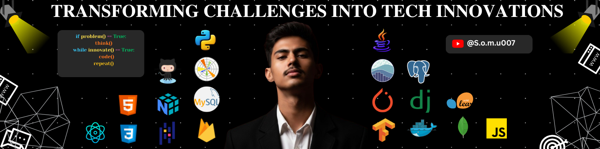

<!-- Replace the filename below with your actual banner image filename after uploading it to your repo -->

# 👋 Hi, I'm Somnath P

### Computer Science Engineer | AI & ML Enthusiast | Full-Stack Developer

---

## 🧠 About Me

> *"Technology means nothing unless it solves something real that's what gets me out of bed."*

Highly motivated and adaptable Computer Science Engineering student, passionate about leveraging technology to solve real-world problems. Eager to learn, quick to adapt, and driven by curiosity and innovation. Seeking an entry-level opportunity in a progressive organization that fosters learning, values creativity, and supports professional growth.
---

## 🛠️ Tech Stack

### 👨‍💻 Programming Languages

### 🌐 Web & Frameworks

### 🤖 AI & Data Science

### ☁️ DevOps & Cloud

### 🗄️ Databases

### 🎨 Design & Tools

---
## 🚀 Projects

## 💼 Experience

### 🏢 Data Scientist Intern — Apollo Pvt *(Jan 2026)*
Analyzed real-world datasets and built machine learning models to uncover patterns and support data-driven decision-making.

### 🏢 Java Developer Intern — IMAGECON India Pvt. Ltd. *(Jan 2025)*
Developed a Smart Face Counting System using Java for production-grade computer vision applications.

---

## 🏆 Achievements & Awards

| 🥇 Achievement | Event | Year |
|----------------|-------|------|
| 🥇 **1st Prize** | Hackathon CATCH 2026 — AI solutions incl. email automation, ambulance optimizer, waste segregation | 2026 |
| 🥇 **1st Prize** | Web Development — KSR ASTRA 2K24 | 2024 |
| 🥇 **1st Prize** | Business Plan Competition — MIT | 2024 |
| 🥇 **1st Prize** | Paper Presentation — ISTE Adhiyamaan College | 2025 |
| 🥈 **2nd Prize** | Paper Presentation — LOYONOVATE, Loyola College | 2025 |
| 🥉 **3rd Prize** | State Level Hackathon — Velammal College of Engineering | 2025 |

---
---

## 📚 Publication

**📄 An Efficient Early Diagnosis for Diabetic Retinopathy Using Quick Convolutional Diagnosis**
> Published at **ICAMT'24** (International Conference on Additive Manufacturing Technology) — *October 18, 2024*

---

## 📊 GitHub Stats

---

## 🤝 Let's Connect!

I'm always open to interesting collaborations, new projects, and opportunities. Feel free to reach out! 🚀

---

⭐ *"Driven by curiosity. Fueled by innovation. Built for impact."*

